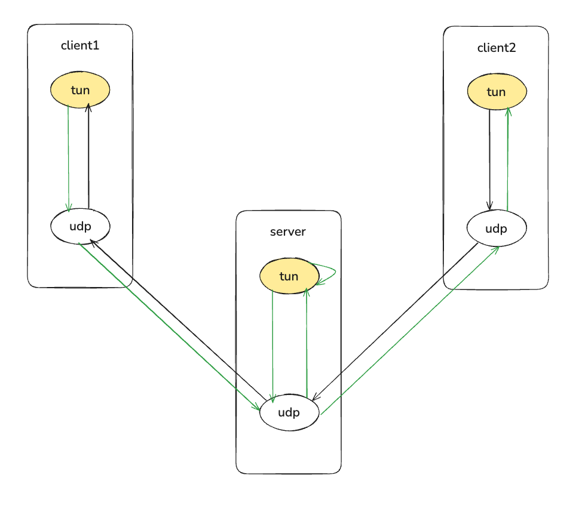

# CaeTun

```
                      __
  ____ _____    _____/  |_ __ __  ____
_/ ___\\__  \ _/ __ \   __\  |  \/    \
\  \___ / __ \\  ___/|  | |  |  /   |  \
 \___  >____  /\___  >__| |____/|___|  /
     \/     \/     \/                \/

```

## Data Transmission

```
+----------------------------------------------------------------+          +----------------------------------------------------------------+
|                                                                |          |                                                                |
|  +--------------------+      +--------------------+            |          |                              +--------------------+            |  +----------------+
|  |     Web Browser    |      |       caetun       |<-----+     |          |                              |       caetun       |<-----+     |  | server 1.1.1.1 |
|  +--------------------+      +--------------------+      |     |          |                              +--------------------+      |     |  +----------------+
|             | 1                        | 5               |     |          |                                        | 13              |     |          |
|.............|..........................|.................|.....|          |........................................|.................|.....|          |
|             |                          |                 |     |          |                                        |                 |     |          |
|       +----------+               +----------+            |     |          |                                  +----------+            |     |          |
|       | socket A |               | socket B |            |     |          |                                  | socket C |            |     |          |
|       +----------+               +----------+            |     |          |                                  +----------+            |     |          |
|             | 2                        | 6               |     |          |                                        | 14              |     |          |
|.............|..........................|..... ...........|.....|          |........................................|.................|.....|          |
|             |                          |                 |     |          |                                        |                 |     |          |
|        +-------------------------------------+         4 |     |          |        +-------------------------------------+        12 |     |          | 17
|        |       Network Protocol Stack        |           |     |          |        |       Network Protocol Stack        |           |     |          |
|        +-------------------------------------+           |     |          |        +-------------------------------------+           |     |          |
|             | 7                        | 3               |     |          |             | 10   | 15                | 11              |     |          |
|.............|......................... |.................|.....|          |.............|......|...................|.................|.....|          |
|             |                          |                 |     |          |             |      |                   |                 |     |          |
|        +----------------+    +----------------+          |     |          |        +----------------+    +----------------+          |     |          |
|        | eth0 10.1.1.1  |    | tun0 10.8.0.1  |          |     |          |        | eth0 10.1.1.2  |    | tun0 10.8.0.2  |          |     |          |
|        +----------------+    +----------------+          |     |          |        +----------------+    +----------------+          |     |          |
|              |                         |                 |     |          |             | 9    | 16                |                 |     |          |
|              | 8                       +-----------------+     |          |             |      |                   +-----------------+     |          |
|              |                                                 |          |             |      |                                           |          |
+--------------|-------------------------------------------------+          +-------------|------|--------------------------------------------+         |
               |                                                                          |      |                                                      |
               +-------------------------------Physical Network---------------------------+      +-----------------Physical Network---------------------+
```


## Usage



### Build the image
```sh
docker build -t caetun .
```

### Start docker compose
```sh
docker compose up -d
```

### Test
```sh
docker exec -it caetun-client1 ping 10.8.0.3
docker exec -it caetun-client2 ping 10.8.0.2
```
